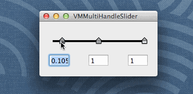

VMMultiHandleSlider
=============

A mimic of iPhoto's multi-handle slider.

Demo:

## Usage
The setup is quite easy. 

### Copy Files
First of all, copy `VMMultiHandleSlider.h` and `VMMultiHandleSlider.m` from `VMMultiHandleSlider` folder in your project.

### Create Custom View
After that, you can choose to add a `Custom View` from IB and set its class to `VMMultiHandleSlider` or you can use `initWithFrame:` initializer in your code.

### Add Handles
To add handle to the slider, use `- (void)addHandle:(NSString *)name image:(NSImage *)image initRatio:(float)initRatio valueBlock:(ValueBlock)valueBlock invValueBlock:(ValueBlock)invValueBlock`. 

- `name` field is key of that slider, it is used for not only updating value but also KVO bindings. So please make sure it is unique. 
- `image` is the handle image, this will be extended to a set of images representing different control states.
- `initRatio` is the initial value of this slider. Should be a normalized value between 0 to 1.
- `valueBlock` and `invValueBlock` as their name indicates, the blocks are used to convert value from normalized ratio to real value.

### Value Change Notification
To get notification if the value of the handles get changed, call `- (void)setValueChangedBlock:(ValueChangedBlock)valueChangedBlock` and pass in a block which takes a `NSDictionary` as argument and returns nothing.

The keys in that dictionary are, as you can predict, the names you set while adding handles. And the values are float-point values represented with `NSNumber` objects that is computed with `valueBlock` you've set when creating the handle.

### KVO
`VMMultiHandleSlider` also supports KVO. To bind the value of a slider to cocoa controls, simply use `values.HANDLE_NAME` as `keyPath`, where `HANDLE_NAME` is the name you've set when you create the object.

For a more detailed example, please refer to the example project I've created in `Example` folder.

## Known Issues (TODO)
- The handle size is a constant (13x17 points)
- Input validation
- No control state for handles (disable, dragged, etc)

## Credits
The handle image I've used in the sample project is copied from `iPhoto` app. :)